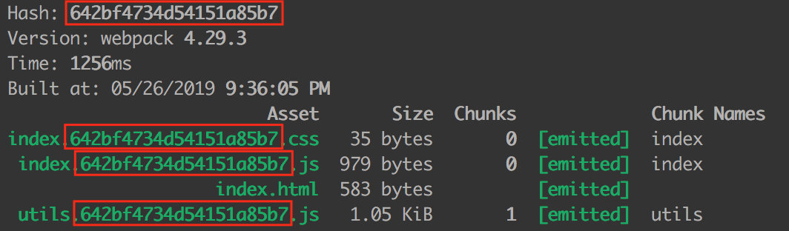
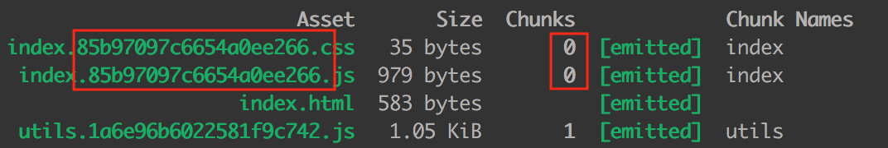
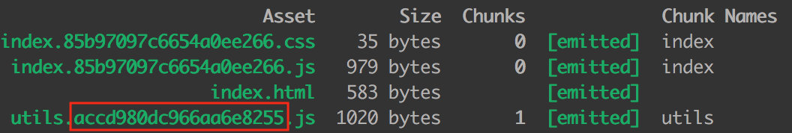

# 构建工具
## webpack
### webpack与grunt、gulp的不同
gulp是是基于流的自动化构建工具，由task定义处理事务，从而构建整体流程，可以配合各种插件，我们不用再做机械重复的工作，替代手工实现自动化工作。完成 js压缩，css压缩，less编译，检查语法，自动刷新页面。
1. 构建工具 
2. 自动化 
3. 提高效率用  
webpack是文件打包工具，可以把项目的各种js文件、css文件等打包合并成一个或多个文件，主要用于模块化方案，预编译模块的方案。
1. 打包工具 
2. 模块化识别 
3. 编译模块代码方案用  
- 三者都是前端构建工具，grunt和gulp在早期比较流行，现在webpack相对来说比较主流，不过一些轻量化的任务还是会用gulp来处理，比如单独打包CSS文件等。
- grunt和gulp是基于任务和流（Task、Stream）的。类似jQuery，找到一个（或一类）文件，对其做一系列链式操作，更新流上的数据， 整条链式操作构成了一个任务，多个任务就构成了整个web的构建流程。webpack是基于入口的。webpack会自动地递归解析入口所需要加载的所有资源文件，然后用不同的Loader来处理不同的文件，用Plugin来扩展webpack功能。  
### webpack核心概念
- Entry：入口，Webpack 执行构建的第一步将从 Entry 开始，可抽象成输入。
- Module：模块，在 Webpack 里一切皆模块，一个模块对应着一个文件。Webpack 会从配置的 Entry 开始递归找出所有依赖的模块。
- Chunk：代码块，一个 Chunk 由多个模块组合而成，用于代码合并与分割。
- Loader：模块转换器，用于把模块原内容按照需求转换成新内容。
- Plugin：扩展插件，在 Webpack 构建流程中的特定时机注入扩展逻辑来改变构建结果或做你想要的事情。
- Output：输出结果，在 Webpack 经过一系列处理并得出最终想要的代码后输出结果。
### 有哪些常见的Loader？他们是解决什么问题的？
- file-loader：把文件输出到一个文件夹中，在代码中通过相对URL去引用输出的文件
- url-loader：和 file-loader 类似，但是能在文件很小的情况下以 base64 的方式把文件内容注入到代码中去
- source-map-loader：加载额外的 Source Map 文件，以方便断点调试
- image-loader：加载并且压缩图片文件
- babel-loader：把 ES6 转换成 ES5
- css-loader：加载CSS，支持模块化、压缩、文件导入等特性
- style-loader：把 CSS代码注入到JavaScript 中，通过DOM操作去加载 CSS。
- eslint-loader：通过 ESLint 检查 JavaScript 代码
### 有哪些常见的Plugin？他们是解决什么问题的？
- define-plugin：定义环境变量
- commons-chunk-plugin：提取公共代码
- uglifyjs-webpack-plugin：通过UglifyES压缩ES6代码
### Loader和Plugin的不同？
#### 不同的作用
Loader直译为"加载器"，用于对模块文件进行编译转换和加载处理。Webpack将一切文件视为模块，但是webpack原生是只能解析js文件，如果想将其他文件也打包的话，就会用到loader。 所以Loader的作用是让webpack拥有了加载和解析非JavaScript文件的能力。   
Plugin直译为"插件"，在构建流程里注入钩子函数。Plugin可以扩展webpack的功能，让webpack具有更多的灵活性。 在 Webpack运行的生命周期中会广播出许多事件，Plugin可以监听这些事件，在合适的时机通过 Webpack 提供的 API 改变输出结果。
#### 不同的用法
Loader在module.rules中配置，也就是说他作为模块的解析规则而存在。 类型为数组，每一项都是一个Object，里面描述了对于什么类型的文件（test），使用什么加载(loader)和使用的参数（options）   
Plugin在plugins中单独配置。 类型为数组，每一项是一个plugin的实例，参数都通过构造函数传入。
### webpack的构建流程是什么?从读取配置到输出文件这个过程尽量说全
1. 初始化参数：从配置文件和 Shell 语句中读取与合并参数，得出最终的参数；
2. 开始编译：用上一步得到的参数初始化 Compiler 对象，加载所有配置的插件，执行对象的 run 方法开始 执行编译；
3. 确定入口：根据配置中的 entry 找出所有的入口文件；
4. 编译模块：从入口文件出发，调用所有配置的 Loader 对模块进行翻译，再找出该模块依赖的模块，再递归本步骤直到所有入口依赖的文件都经过了本步骤的处理；
5. 完成模块编译：在经过第4步使用 Loader 翻译完所有模块后，得到了每个模块被翻译后的最终内容以及它们之间的依赖关系；
6. 输出资源：根据入口和模块之间的依赖关系，组装成一个个包含多个模块的 Chunk，再把每个 Chunk 转换成一个单独的文件加入到输出列表，这步是可以修改输出内7容的最后机会；
7. 输出完成：在确定好输出内容后，根据配置确定输出的路径和文件名，把文件内容写入到文件系统。
### webpack的热更新是如何做到的？说明其原理？
https://zhuanlan.zhihu.com/p/30669007  
https://zhuanlan.zhihu.com/p/44438844  
- 第一步，在 webpack 的 watch 模式下，文件系统中某一个文件发生修改，webpack 监听到文件变化，根据配置文件对模块重新编译打包，并将打包后的代码通过简单的 JavaScript 对象保存在内存中。
- 第二步是 webpack-dev-server 和 webpack 之间的接口交互，而在这一步，主要是 dev-server 的中间件 webpack-dev-middleware 和 webpack 之间的交互，webpack-dev-middleware 调用 webpack 暴露的 API对代码变化进行监控，并且告诉 webpack，将代码打包到内存中。
- 第三步是 webpack-dev-server 对文件变化的一个监控，这一步不同于第一步，并不是监控代码变化重新打包。当我们在配置文件中配置了devServer.watchContentBase 为 true 的时候，Server 会监听这些配置文件夹中静态文件的变化，变化后会通知浏览器端对应用进行 live reload。注意，这儿是浏览器刷新，和 HMR 是两个概念。
- 第四步也是 webpack-dev-server 代码的工作，该步骤主要是通过 sockjs（webpack-dev-server 的依赖）在浏览器端和服务端之间建立一个 websocket 长连接，将 webpack 编译打包的各个阶段的状态信息告知浏览器端，同时也包括第三步中 Server 监听静态文件变化的信息。浏览器端根据这些 socket 消息进行不同的操作。当然服务端传递的最主要信息还是新模块的 hash 值，后面的步骤根据这一 hash 值来进行模块热替换。
- webpack-dev-server/client 端并不能够请求更新的代码，也不会执行热更模块操作，而把这些工作又交回给了 webpack，webpack/hot/dev-server 的工作就是根据 webpack-dev-server/client 传给它的信息以及 dev-server 的配置决定是刷新浏览器呢还是进行模块热更新。当然如果仅仅是刷新浏览器，也就没有后面那些步骤了。
- HotModuleReplacement.runtime 是客户端 HMR 的中枢，它接收到上一步传递给他的新模块的 hash 值，它通过 JsonpMainTemplate.runtime 向 server 端发送 Ajax 请求，服务端返回一个 json，该 json 包含了所有要更新的模块的 hash 值，获取到更新列表后，该模块再次通过 jsonp 请求，获取到最新的模块代码。这就是上图中 7、8、9 步骤。
- 而第 10 步是决定 HMR 成功与否的关键步骤，在该步骤中，HotModulePlugin 将会对新旧模块进行对比，决定是否更新模块，在决定更新模块后，检查模块之间的依赖关系，更新模块的同时更新模块间的依赖引用。
- 最后一步，当 HMR 失败后，回退到 live reload 操作，也就是进行浏览器刷新来获取最新打包代码。
### 如何利用webpack来优化前端性能？（提高性能和体验）
用webpack优化前端性能是指优化webpack的输出结果，让打包的最终结果在浏览器运行快速高效。    
- 压缩代码。删除多余的代码、注释、简化代码的写法等等方式。可以利用webpack的UglifyJsPlugin和ParallelUglifyPlugin来压缩JS文件， 利用cssnano（css-loader?minimize）来压缩css
- 利用CDN加速。在构建过程中，将引用的静态资源路径修改为CDN上对应的路径。可以利用webpack对于output参数和各loader的publicPath参数来修改资源路径
- 删除死代码（Tree Shaking）。将代码中永远不会走到的片段删除掉。可以通过在启动webpack时追加参数--optimize-minimize来实现
- 提取公共代码。
### 如何提高webpack的构建速度？
- 多入口情况下，使用CommonsChunkPlugin来提取公共代码
- 通过externals配置来提取常用库
- 利用DllPlugin和DllReferencePlugin预编译资源模块 通过DllPlugin来对那些我们引用但是绝对不会修改的npm包来进行预编译，再通过DllReferencePlugin将预编译的模块加载进来。
- 使用Happypack 实现多线程加速编译
- 使用webpack-uglify-parallel来提升uglifyPlugin的压缩速度。 原理上webpack-uglify-parallel采用了多核并行压缩来提升压缩速度
- 使用Tree-shaking和Scope Hoisting来剔除多余代码

### Tree Shaking原理
理解链接：https://zhuanlan.zhihu.com/p/32831172     
https://juejin.cn/post/6844903544756109319     
https://juejin.cn/post/6844903544760336398  
#### 本质
Tree-shaking的本质是消除无用的js代码。无用代码消除在广泛存在于传统的编程语言编译器中，编译器可以判断出某些代码根本不影响输出，然后消除这些代码，这个称之为DCE（dead code elimination）   
#### Dead Code 一般具有以下几个特征
- 代码不会被执行，不可到达
- 代码执行的结果不会被用到
- 代码只会影响死变量（只写不读）
#### ES6 module 特点：
- 只能作为模块顶层的语句出现
- import 的模块名只能是字符串常量
- import binding 是 immutable的

ES6模块依赖关系是确定的，和运行时的状态无关，可以进行可靠的静态分析，这就是tree-shaking的基础。     
所谓静态分析就是不执行代码，从字面量上对代码进行分析，ES6之前的模块化，比如我们可以动态require一个模块，只有执行后才知道引用的什么模块，这个就不能通过静态分析去做优化。 
这是 ES6 modules 在设计时的一个重要考量，也是为什么没有直接采用 CommonJS，正是基于这个基础上，才使得 tree-shaking 成为可能，这也是为什么 rollup 和 webpack 2 都要用 ES6 module syntax 才能 tree-shaking。


ES6的模块引入是静态分析的，故而可以在编译时正确判断到底加载了什么代码。
分析程序流，判断哪些变量未被使用、引用，进而删除此代码。
### webpack的入口文件怎么配置，多个入口怎么分割
### 看到你的项目用到了Babel的一个插件，transform-runtime以及stage-2，说下他们的作用
### webpack配置用的webpack.optimize.UglifyJsPlugin,有没有觉得压缩速度很慢，有什么办法提升速度。
### webpack的一些原理和机制，怎么实现的
### babel把es6转换成es5或者es3之类的原理，有没有研究

### webpack中，hash,chunkhash, contenthash的区别是什么？
参考链接：https://www.cnblogs.com/skychx/p/webpack-hash-chunkhash-contenthash.html   
#### hash
hash计算是跟整个项目的构建相关， ，我们做一个简单的 demo。文件目录如下：  
```js
src/
├── index.css
├── index.html
├── index.js
└── utils.js
```
webpack 的核心配置如下（省略了一些 module 配置信息）：
```js
{
    entry: {
        index: "../src/index.js",
        utils: '../src/utils.js',
    },
    output: {
        filename: "[name].[hash].js",  // 改为 hash
    },
    
    ......
    
    plugins: [
        new MiniCssExtractPlugin({
            filename: 'index.[hash].css' // 改为 hash
        }),
    ]
}
```
生成的文件名如下：
    
我们可以发现，生成文件的 hash 和项目的构建 hash 都是一模一样的。
#### chunkhash
因为 hash 是项目构建的哈希值，项目中如果有些变动，hash 一定会变，比如说我改动了 utils.js 的代码，index.js 里的代码虽然没有改变，但是大家都是用的同一份 hash。hash 一变，缓存一定失效了，这样子是没办法实现 CDN 和浏览器缓存的。    
chunkhash 就是解决这个问题的，它根据不同的入口文件(Entry)进行依赖文件解析、构建对应的 chunk，生成对应的哈希值。      
我们再举个例子，我们对 utils.js 里文件进行改动：
```js
export function square(x) {
    return x * x;
}

// 增加 cube() 求立方函数
export function cube(x) {
    return x * x * x;
}
```
然后把 webpack 里的所有 hash 改为 chunkhash：
```js
{
    entry: {
        index: "../src/index.js",
        utils: '../src/utils.js',
    },
    output: {
        filename: "[name].[chunkhash].js", // 改为 chunkhash
    },
          
    ......
    
    plugins: [
        new MiniCssExtractPlugin({
            filename: 'index.[chunkhash].css' // // 改为 chunkhash
        }),
    ]
}
```
构建结果如下:   
   
我们可以看出，chunk 0 的 hash 都是一样的，chunk 1 的 hash 和上面的不一样。     
假设我又把 utils.js 里的 cube() 函数去掉，再打包：
  
对比可以发现，只有 chunk 1 的 hash 发生变化，chunk 0 的 hash 还是原来的。   
#### contenthash
我们更近一步，index.js 和 index.css 同为一个 chunk，如果 index.js 内容发生变化，但是 index.css 没有变化，打包后他们的 hash 都发生变化，这对 css 文件来说是一种浪费。如何解决这个问题呢？    
contenthash 将根据资源内容创建出唯一 hash，也就是说文件内容不变，hash 就不变。    
我们修改一下 webpack 的配置：  
```js
{
    entry: {
        index: "../src/index.js",
        utils: '../src/utils.js',
    },
    output: {
        filename: "[name].[chunkhash].js",
    },
      
    ......
    
    plugins: [
        new MiniCssExtractPlugin({
            filename: 'index.[contenthash].css' // 这里改为 contenthash
        }),
    ]
}
```
我们对 index.js 文件做了 3 次修改（就是改了改 log 函数的输出内容，过于简单就先不写了），然后分别构建，结果截图如下：
### 一句话总结：
hash 计算与整个项目的构建相关；    
chunkhash 计算与同一 chunk 内容相关；    
contenthash 计算与文件内容本身相关。    
